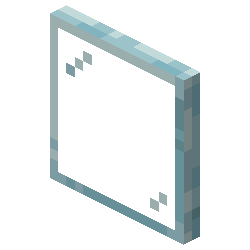
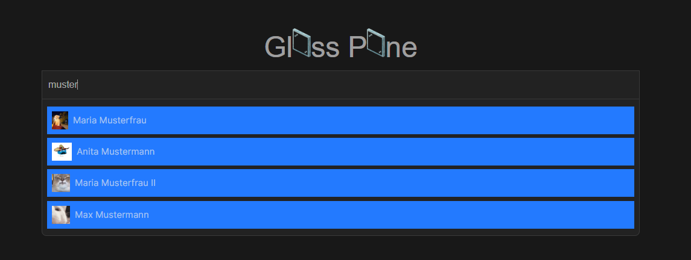
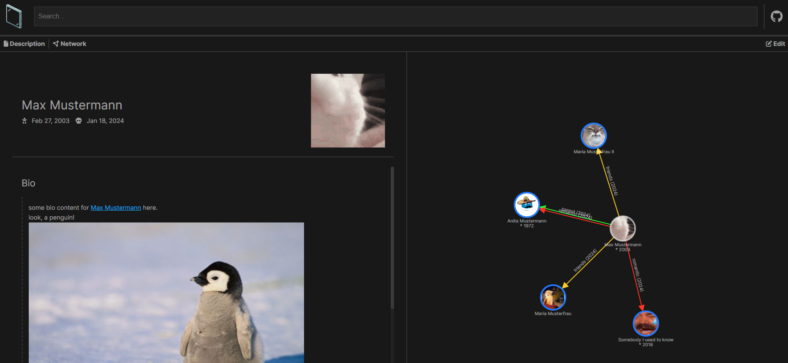
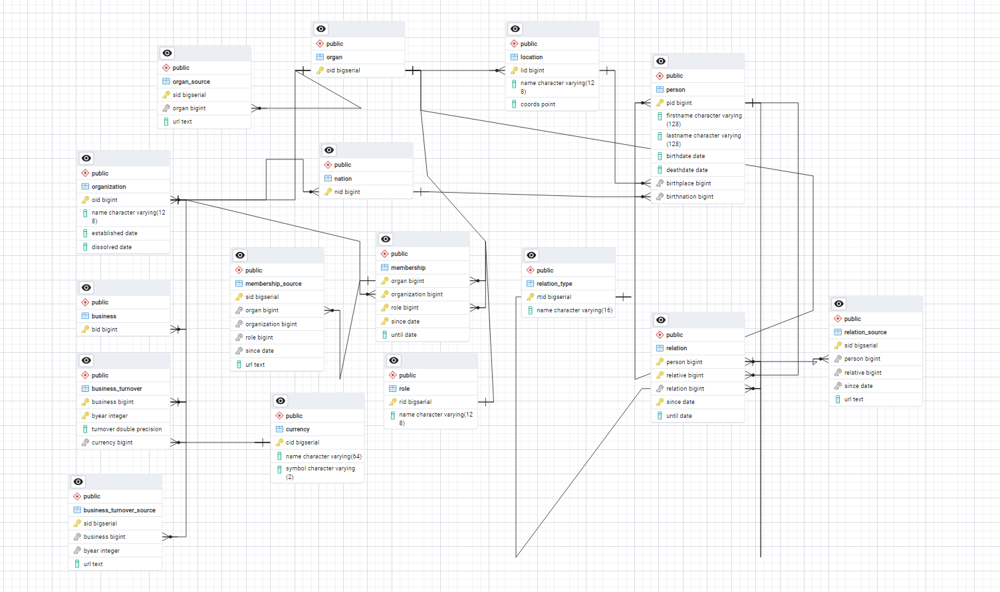

  

  <h1>Glass Pane</h1>

  
  
  

---

> *Inspired by projects like [littlesis.org](https://littlesis.org/) this too aims to be "the involuntary social-media of the 1%". For now, mainly focused on Austrian politics and its surroundings.*

## Preview

Here are some preview images of what the page will look like eventually - however, keep in mind that this project is still undergoing major development (even though I kinda started working on this a long time ago).

***Image 1:** The main search page*

***Image 2:** The info page of a person/business with their relations*

## ERD

Also, here is the *Entity Relationship Diagram* of the database behind this project - as exported using *pgAdmin*. I know the lines are a bit fucked up, but I promise that's not my fault - *pgAdmin* was just really messing with me.

**Also ...** I'll probably still change this in the future, as I'm not really happy about many things here, but... I'll stick with it for now :poop:. I mean, I just want to have something that works for now - I can always fix stuff later... right?!

## Feature Ideas

Here a collection of ideas that would be really nice to have in a somewhat finished version of this project.

| Status | Name                 | Description                                                                                                                                                                                                                                                  |
| ------ | -------------------- | ------------------------------------------------------------------------------------------------------------------------------------------------------------------------------------------------------------------------------------------------------------ |
| 🔃      | Socials              | Have an extra section for the social media accounts of people/organizations.                                                                                                                                                                                 |
| ❌      | Social media mutuals | It would also be amazing to integrate a tool such as my own [d4v1d](https://github.com/MattMoony/d4v1d) which could automatically crawl the social media account of people/organizations in order to import social media mutuals into the connections graph. |
| ❌      | Graph queries        | Being able to run queries on the graph of connections - e.g. "find the shortest path of connections between these two people", etc.                                                                                                                          |
| ❌      | Tags                 | Assign tags to people that can then be used in queries as well - e.g. "neonazi", "lobbyist", "aristocrat", etc.                                                                                                                                              |
| ❌      | Timelines            | Instead of just writing everything in a entity's bio, actually split information up a bit - i.e. have a timeline of releveant events for this person/organization, etc.                                                                                      |
| ❌      | Embeddable           | Provide an endpoint that can be used for embedding graphs with selected entitys and connections - could be used e.g. if you wanted to write a blog post about a certain person's connections or something.                                                   |
| ❌      | RSS-Feeds            | Integrate RSS feeds from newspapers to automatically add new sources to people as news are published about them.                                                   |
