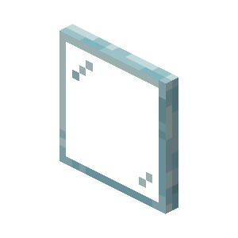

  

  <h1>Glass Pane</h1>

  
  
  

---

> *Inspired by projects like [littlesis.org](https://littlesis.org/) this too aims to be "the involuntary social-media of the 1%". For now, mainly focused on Austrian politics and its surroundings.*

## Preview

Here are some preview images of what the page will look like eventually - however, keep in mind that this project is still undergoing major development (even though I kinda started working on this a long time ago).

***Image 1:** The main search page*

***Image 2:** The info page of a person/business with their relations*
